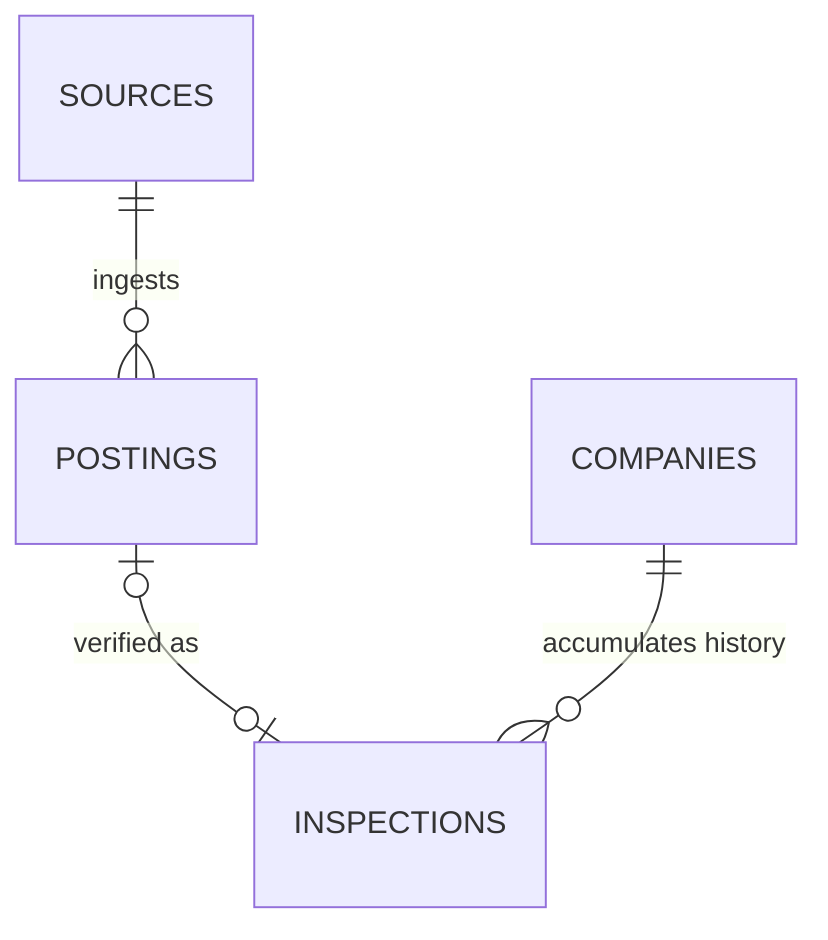

<div align="center">

```
  ██
 ████
█ ██ █
██████
 ████
```

# Lighthouse

**A verification engine for remote work.**

[](https://nextjs.org)
[](https://ai.google.dev)
[](https://supabase.com)
[](https://typescriptlang.org)
[]()

_Read the posting. Trust the work. Cited like a journalist. Audited like a credit report._

[Quick start](#quick-start) · [Methodology](#methodology--the-four-pillars) · [Architecture](#architecture-at-a-glance) · [Database](#database-model) · [API](#http-api-reference)

</div>

---

## Table of contents

1. [Mission](#mission)
2. [The problem we are solving](#the-problem-we-are-solving)
3. [Architecture at a glance](#architecture-at-a-glance)
4. [Tech stack](#tech-stack)
5. [Methodology — the four pillars](#methodology--the-four-pillars)
6. [Scoring](#scoring)
7. [Database model](#database-model)
8. [AI verification pipeline (Gemini)](#ai-verification-pipeline-gemini)
9. [Daily ingestion cron (04:00 ET)](#daily-ingestion-cron-0400-et)
10. [Job-board source matrix](#job-board-source-matrix)
11. [Manual verification flow](#manual-verification-flow)
12. [HTTP API reference](#http-api-reference)
13. [Project structure](#project-structure)
14. [Security, privacy, and Canadian law](#security-privacy-and-canadian-law)
15. [Quick start](#quick-start)
16. [Environment variables](#environment-variables)
17. [Local development](#local-development)
18. [Deployment](#deployment)
19. [Status & roadmap](#status--roadmap)
20. [Hackathon judging alignment](#hackathon-judging-alignment)
21. [License & disclaimer](#license--disclaimer)

---

## Mission

We do not curate listings. We **inspect** whatever you bring us — LinkedIn,
Indeed, Job Bank Canada, a recruiter DM, a friend's referral — and show our
work.

Five non-negotiable principles:

1. **Real, first.** The company exists, the recruiter is identifiable, and
   the posting lives on a surface the company actually controls.
2. **Active, not warehoused.** The role is open and being filled this week —
   not collecting résumés for months.
3. **Fair, not exploitative.** The deal is coherent: scope-to-comp ratio,
   equity, process. A small honest stipend for a small honest scope passes;
   a senior-IC scope at a junior-IC price does not.
4. **Credible, even if small.** A two-person bootstrapped studio with a real
   product and recent commits is credible. A 50-person "AI" company with no
   product is not. **We bias for honest small operators.**
5. **Cited, always.** Every claim links to its primary source. Every score
   is decomposable into the evidence behind it. No black boxes.

---

## The problem we are solving

> **How do we identify high-quality, legitimate remote job opportunities?**

Job-scam losses in North America **tripled from $90M (2020) to $501M (2024)**.
AI made the fakes look real; meanwhile real recruiters miss great candidates
because every applicant has been burned by ghost listings, reposts, and "we
will get back to you" companies that won't.

Existing job boards are optimized to **maximize listings**, not to verify
them. There is no consumer-facing credit-bureau equivalent for the posting
side of the labour market.

**Lighthouse is that bureau** — built in Toronto, PIPEDA-aware, Canada-first.

---

## Architecture at a glance

```
                  ┌──────────────────────────────────────────┐
                  │  Next.js 16 (App Router · RSC · Edge)    │
                  │                                          │
   user paste URL │  ┌────────────┐   ┌──────────────────┐   │
   ───────────────┼──►  /api/     │   │  /api/library    │   │
                  │  │  verify    │   │  /api/stats      │   │
                  │  └─────┬──────┘   └────────┬─────────┘   │
                  └────────┼───────────────────┼─────────────┘
                           │                   │
                           ▼                   ▼
                   ┌───────────────┐    ┌──────────────┐
                   │ Gemini 2.5    │    │  Supabase    │
                   │ Flash         │    │  Postgres    │
                   │ + Google      │    │  (RLS on)    │
                   │ Search ground │◄───┤  pg_cron     │
                   └───────┬───────┘    │              │
                           │            │  inspections │
                           ▼            │  postings    │
                   ┌───────────────┐    │  sources     │
                   │ evidence pack │    │  pillars     │
                   │ + structured  │    │  evidence    │
                   │ 4-pillar JSON │───►│  ...         │
                   └───────────────┘    └──────────────┘
                                                ▲
                                                │
                                       ┌────────┴───────┐
                                       │ Vercel Cron    │
                                       │ 04:00 ET daily │
                                       │ → /api/ingest  │
                                       └────────────────┘
                                                │
                       ┌────────────────────────┼─────────────────────┐
                       ▼                        ▼                     ▼
                ┌─────────────┐         ┌──────────────┐      ┌──────────────┐
                │ Job Bank CA │         │  Adzuna /    │      │ Remotive /   │
                │ XML feed    │         │  JSearch /   │      │ RemoteOK /   │
                │ (gov.ca)    │         │  Jooble      │      │ WeWorkRemote │
                └─────────────┘         └──────────────┘      └──────────────┘
```

### Two data flows

Lighthouse splits verification and scraping into two distinct pipelines to balance background concurrency with low user-facing latency.

#### Flow A — Manual Verification (User-Driven, Foregound)

This pipeline processes job URLs submitted directly by seekers in the Lighthouse dashboard interface.

```
URL paste  →  normalize  →  cache lookup (Supabase)
                                  │
                ┌─── HIT (< 7d) ──┴─── MISS ───┐
                │                              ▼
                │                       Gemini Stage 1
                │                       (Google Search ground)
                │                              │
                │                              ▼
                │                       Gemini Stage 2
                │                       (Structured JSON)
                │                              │
                │                              ▼
                │                       Normalize + clamp
                │                              │
                │                              ▼
                │                       Upsert → Supabase
                │                              │
                └──────────────► return Posting + citations
```

##### Process Sequence
1. **Submit & Sanitize**: User pastes a URL. Lighthouse trims the input, appends `https:` protocol if missing, strips 28 known tracking parameters (e.g., `utm_*`, `ref`), sorts query tags, and strips trailing slashes to generate a stable, canonical cache key (`url_normalized`).
2. **Cache Inspection**: The server checks the `public.inspections` table for any row matches on `url_normalized`. 
   * **Cache Hit**: If a verified inspection exists and was created within the last **7 days** (our `CACHE_TTL_MS` threshold), Lighthouse returns the cached report immediately (under **50ms**).
   * **Cache Miss**: If no match exists or the cached report is stale (older than 7 days), it triggers a new live verification.
3. **Stage 1 — Grounded Agentic Research**: Lighthouse invokes **Gemini 2.5 Flash** with Google Search grounding enabled. The model behaves as an investigative researcher fanning out queries (e.g., WHOIS registry checks, SEC corporate filings, LinkedIn profiles, Reddit discussion nodes, and Levels.fyi pay tables) to gather a rigorous fact sheet.
   * **Rate-Limit Fallback**: If the grounded search quota is exhausted, Lighthouse falls back dynamically to ungrounded **Gemini 3.1 Flash-Lite / 2.5 Flash-Lite** models operating on frozen parametric knowledge to deliver advisory, ungrounded reports flagged in the UI as preliminary.
4. **Stage 2 — Schema Compaction**: A second LLM pass coerces the raw facts compiled in Stage 1 into a strict, programmatic JSON schema mapped to our internal types.
5. **Algorithmic Normalization & Clamping**: A backend normalization layer enforces strict scoring bounds (e.g., capping scores at 70 if no strong citations exist, capping at 75 if under 3 evidence items exist, and enforcing an instant cap of 35 if illegal pay/fee patterns are detected).
6. **Relational Persistence**: The parsed result is written into the database using a centralized upsert helper in `supabase.ts`. Under-the-hood Postgres triggers calculate company aggregates and update trust cards.
7. **Hydrated Delivery**: The client displays the formatted report containing the 4-pillar scores, recruiter health indicator, and peer comparable items.

---

#### Flow B — Daily Ingestion Scraper (Background, Scheduled)

This pipeline runs silently on an automated schedule using Vercel Cron.

```
04:00 ET  →  Vercel Cron  →  GET /api/ingest (Bearer CRON_SECRET)
                                    │
                                    ▼
                    for each enabled source:
                       fetch newest 5 postings
                       normalize each URL
                       upsert into postings (status='new')
                                    │
                                    ▼
                    for each posting with status='new':
                       run manual-verify pipeline above
                       update posting.status='verified'
                                    │
                                    ▼
                    log to ingestion_runs (source, counts, ms, error)
```

##### Process Sequence
1. **Trigger & Authorization**: Vercel triggers the `/api/ingest` handler daily at **04:00 AM Eastern Time**. Invocations must include an `Authorization: Bearer ${CRON_SECRET}` header to bypass security guards.
2. **Registry Lookup**: The system fetches active scraper endpoints from `public.sources` (e.g., Job Bank Canada feed, WWR RSS boards).
3. **Fanned Fetching & Deduplication**: For each adapter, the scraper fetches up to 5 of the freshest listings. URLs are normalized and upserted into `public.postings` with a default status of `'new'`. Existing matching records are preserved so the `first_seen_at` field remains accurate.
4. **Inline Verification Pipeline**: The system scans `public.postings` for entries with status `'new'` and sequentially executes the Manual Verification Flow (A) in the background.
   * **Resource Bounds**: To keep execution durations safely inside Vercel's server ceiling (60 seconds) and manage Gemini API quotas, ingestion limits verifications to a maximum of **2 parallel items** per cron run. The remaining backlog is processed during subsequent runs.
5. **Audit Logging**: The run concludes by saving telemetry (durations, fetched counts, verify rates, and isolated adapter exceptions) inside the `public.ingestion_runs` table.

---

---

## Tech stack

| Layer            | Choice                                          | Why                                                       |
| ---------------- | ----------------------------------------------- | --------------------------------------------------------- |
| Frontend         | Next.js 16 (App Router), React 19               | Server components, edge runtime, mature ecosystem         |
| Styling          | Tailwind 4 + hand-tuned newspaper system        | Editorial typography, paper-grain aesthetic, no JS deps   |
| Types            | TypeScript (strict)                             | Catches schema drift at compile time                      |
| Server runtime   | Node.js (route handlers, `maxDuration=60`)      | Gemini calls take 20–30s; edge runtime is too short       |
| AI               | Google Gemini 2.5 Flash + `googleSearch` tool   | Native grounding, structured JSON, low latency, low cost  |
| Database         | Supabase Postgres (RLS enabled)                 | RLS-friendly, pg_cron built-in, generous free tier        |
| Scheduler        | Vercel Cron → API route                         | Debuggable; observable; trivially portable                |
| Auth (V1.3+)     | Supabase Auth (email magic link)                | Tight RLS integration                                     |
| Hosting          | Vercel                                          | Native Next.js, cron primitives, edge POPs                |

---

## Methodology — the four pillars

> A trustworthy listing is one whose claims can be **independently corroborated**
> in under three seconds. Lighthouse fans out across public sources — registries,
> archives, professional networks, compensation databases, scam-report forums —
> and stitches the evidence into one annotated report. Every claim cites its
> source. Every score is decomposable. No black box.

### §1 · Real — _Does this company exist, and did it write this posting?_

| Sub-check         | Source(s)                                | Signal                                              |
| ----------------- | ---------------------------------------- | --------------------------------------------------- |
| WHOIS lookup      | whois.iana.org, who.is                   | Domain age, registrant continuity, NS stability     |
| Registry match    | SEC EDGAR, Companies House, OpenCorp     | Legal entity in good standing                       |
| Recruiter graph   | LinkedIn                                 | Tenure ≥ 6 months, prior roles, posting history     |
| Copy novelty      | Lighthouse diff index                    | JD body diffed against historical listings          |
| Application path  | Company ATS (Greenhouse, Lever, Ashby)   | Own subdomain vs. Google Form / Gmail address       |

**Strong pattern:** named recruiter, multi-year LinkedIn tenure, posting on
the company's own ATS subdomain.
**Fail pattern:** privacy-masked <60-day domain, no registry hit,
Gmail-domain recruiter contact, body matches 5+ unrelated boards.

### §2 · Active — _Is the role open and being filled, or warehousing résumés?_

| Sub-check        | Source(s)                                 | Signal                                       |
| ---------------- | ----------------------------------------- | -------------------------------------------- |
| Snapshot trace   | archive.org Wayback                       | First-seen, version count, reposts           |
| Repost diff      | Public job boards                         | Identical body text across destinations      |
| Community signal | Reddit, Blind, HN "Who is hiring"         | Response-rate threads                        |
| Server hints     | HTTP `Last-Modified`, `ETag`              | Careers-page edit cadence                    |
| Capacity check   | LinkedIn org page                         | Hiring velocity vs. company size             |

**Pass:** first-seen ≤ 30 days, no identical reposts, recruiter responds in
≤ 5 days per community threads. **Fail:** reposted 4+ times unchanged over
60+ days, multiple "no response" threads, "ghost" pattern.

### §3 · Fair — _Is the deal coherent — pay, equity, scope, process?_

| Sub-check        | Source(s)                                 | Signal                                            |
| ---------------- | ----------------------------------------- | ------------------------------------------------- |
| Comp percentile  | Levels.fyi, Glassdoor, Payscale           | Band-by-level-by-region positioning               |
| Equity sanity    | Carta benchmarks                          | Median ranges by stage (0.05–0.5% typical at IC)  |
| Scope ratio      | Lighthouse rubric                         | Responsibilities-per-dollar coherence             |
| Process fees     | Posting body, FTC pattern library         | $-for-training, $-for-equipment patterns          |
| ID requests      | Posting body                               | Government ID asked before any interview          |

> **This is the most misunderstood pillar.** A small startup paying senior
> band for a senior role is fair. A "Senior Engineer · 1-month contract ·
> $2,000 stipend" is NOT fair even if the senior role itself is real.
> A 12-month full-time role at market percentile is fair even if the comp is
> modest. We score **scope-to-comp coherence**, not absolute compensation.

**Instant fail:** any request for candidate payment (training fees, cert
costs, equipment they buy) or ID/SSN before an interview.

### §4 · Credible — _Does the company actually do anything?_

| Sub-check       | Source(s)                                 | Signal                                            |
| --------------- | ----------------------------------------- | ------------------------------------------------- |
| Product surface | The company's own site                    | Live signup, billing, status page, changelog      |
| Founder graph   | LinkedIn                                  | Pre-company history, mutual ties                  |
| Funding ledger  | Crunchbase, press                         | Investor verification, round dates                |
| Code activity   | GitHub                                    | Org commit volume, last 30–90 days                |
| Public surface  | Press, podcasts, blog                     | Evidence of operations beyond the careers page    |

> **We bias for small honest companies.** A bootstrapped studio with a live
> product and recent commits passes. A 50-person "AI" company with no
> product, no GitHub, no press, and stock-photo founders does not.

### A note on bias

A 14-day-old domain is not automatically suspect; a 14-year-old domain is
not automatically safe. Each signal carries a **weight**, each report shows
the full evidence trail, and humans — you — make the final call. We do not
blocklist companies. We surface what we found and let you read it.

---

## Scoring

### Verdict bands

| Score band | Verdict       | UI accent           | Meaning                                              |
| ---------- | ------------- | ------------------- | ---------------------------------------------------- |
| 80 – 100   | `VERIFIED`    | trust-green         | All four pillars pass; evidence strong across board  |
| 50 – 79    | `INVESTIGATE` | amber               | At least one pillar fails or is mixed; ask questions |
| 0 – 49     | `DECLINE`     | ink (newsprint red) | Multiple pillars fail; high scam probability         |

### Composition

The overall score is the **equal-weighted mean** of the four pillar scores,
rounded to the nearest integer. Pillar scores are themselves derived from a
weighted sum of evidence:

```
pillar_score = clamp(
    base_for_verdict
  + 8 × count(strong evidence)
  + 4 × count(medium evidence)
  + 1 × count(weak evidence)
  − 25 × count(fail patterns),
  0, 100
)
overall       = round((Real + Active + Fair + Credible) / 4)
```

### Hard rules layered on top

1. A pillar with **no strong evidence** cannot score above **70**.
2. A pillar with at least one **fail pattern** cannot score above **35**.
   _Examples:_ process fees, fabricated registration claim, 100% of Wayback
   snapshots stale for 90+ days, recruiter contact on a free email domain.
3. Being small / unknown / bootstrapped is **not** a fail signal for Credible
   — score on whether the company does anything real, not on whether it is
   famous.
4. Score Fair on **scope-to-comp coherence**, not absolute com## Database model

We use **Supabase Postgres** with row-level security enabled on every public table. The database structure is a fully normalized relational model tied together by triggers and indices, optimized for rapid, consistent rollups and full data isolation.

### Active Relational Schema

The ledger runs on five core tables:

1. **`public.sources`** — Ingestion endpoints configuration.
2. **`public.postings`** — Scraped job posting queue before verification.
3. **`public.inspections`** — Completed audits containing scores, verdicts, and evidence lists.
4. **`public.companies`** — Historical aggregate data compiled from inspections.
5. **`public.ingestion_runs`** — Periodic scrape execution auditing.

---

### Table Specifications

#### 1. `public.sources`
Stores configuration and rate-limiting limits for external job board adapters.
```sql
create table public.sources (
  id                    uuid primary key default gen_random_uuid(),
  slug                  text not null unique,
  display_name          text not null,
  kind                  text not null check (kind in ('api','rss','xml','html')),
  base_url              text,
  ingest_enabled        boolean not null default true,
  fetch_limit           smallint not null default 5,
  rate_limit_per_minute smallint not null default 30,
  last_run_at           timestamptz,
  last_ok_at            timestamptz,
  notes                 text,
  config                jsonb not null default '{}'::jsonb
);
```

#### 2. `public.postings`
Serves as the raw ingestion queue. Normalizes URL keys to avoid scraping duplicate opportunities.
```sql
create table public.postings (
  id                 uuid primary key default gen_random_uuid(),
  source_slug        text not null references public.sources(slug),
  source_external_id text,
  url                text not null,
  url_normalized     text not null unique, -- Deduplication key
  title              text not null,
  company            text,
  location           text,
  description        text,
  posted_at          timestamptz,
  first_seen_at      timestamptz not null default now(),
  last_seen_at       timestamptz not null default now(),
  raw_payload        jsonb,
  status             text not null default 'new' check (status in ('new','verifying','verified','failed')),
  inspection_id      uuid references public.inspections(id),
  last_attempt_at    timestamptz,
  attempt_count      smallint not null default 0,
  attempt_error      text
);
```

#### 3. `public.inspections`
Our completed audit trail. JSONB sub-schemas store structured, nested evidence lists, comparables, and citations.
```sql
create table public.inspections (
  id              uuid primary key default gen_random_uuid(),
  company_id      uuid references public.companies(id),
  url             text not null,
  url_normalized  text not null unique,
  company         text not null,
  role            text not null,
  location        text not null,
  is_remote       boolean not null default true,
  comp_min        integer not null default 0,
  comp_max        integer not null default 0,
  equity          text not null default '—',
  posted          text not null default 'unknown',
  summary         text not null default '',
  score           smallint not null check (score between 0 and 100),
  verdict         text not null check (verdict in ('VERIFIED','INVESTIGATE','DECLINE')),
  headline        text not null default '',
  editorial       text not null default '',
  pillars         jsonb not null default '[]'::jsonb,     -- 4-Pillar breakdown
  activity        jsonb not null default '{}'::jsonb,     -- Recruiter activity indicators
  comparables     jsonb not null default '[]'::jsonb,     -- 3 Peer opportunities
  citations       jsonb not null default '[]'::jsonb,     -- Link list to grounding URLs
  evidence_raw    text,
  verify_ms       integer,
  created_at      timestamptz not null default now()
);
```

#### 4. `public.companies`
Tracks continuous company health indicators and founder matrices accumulated across independent verification cycles.
```sql
create table public.companies (
  id                   uuid primary key default gen_random_uuid(),
  slug                 text not null unique,
  display_name         text not null,
  primary_domain       text,
  inspection_count     integer not null default 0,
  mean_score           numeric(5,2),
  last_score           smallint,
  last_verdict         text check (last_verdict in ('VERIFIED','INVESTIGATE','DECLINE')),
  last_inspected_at    timestamptz,
  linkedin_url         text,
  glassdoor_url        text,
  crunchbase_url       text,
  github_org           text,
  founded_year         smallint,
  hq_country           text,
  employee_count_est   integer,
  funding_total_usd    bigint,
  notes                text,
  created_at           timestamptz not null default now()
);
```

#### 5. `public.ingestion_runs`
Maintains strict audits for background cron and manual ingestion processes.
```sql
create table public.ingestion_runs (
  id              uuid primary key default gen_random_uuid(),
  started_at      timestamptz not null default now(),
  finished_at     timestamptz,
  status          text not null default 'running' check (status in ('running','ok','partial','failed')),
  trigger         text not null default 'cron' check (trigger in ('cron','manual')),
  sources_summary jsonb not null default '{}'::jsonb,
  total_seen      integer not null default 0,
  total_new       integer not null default 0,
  total_verified  integer not null default 0,
  duration_ms     integer,
  error           text
);
```

---

### Database Triggers & Automations

Lighthouse delegates transactional referential constraints directly to PostgreSQL to ensure atomic synchronization:

1. **`inspections_upsert_company`**: 
   * Runs `AFTER INSERT ON public.inspections`.
   * Automatically computes the company slug and slugs matching prior domains.
   * Inserts a record into `public.companies` or updates aggregates: incrementing `inspection_count`, averaging scores (`mean_score`), and recording the `last_verdict` and `last_inspected_at` fields.
2. **`postings_link_on_inspection`**:
   * Runs `AFTER INSERT ON public.inspections`.
   * Automatically scans `public.postings` for unverified entries matching the inspection's canonical normalized URL.
   * Links the entry with the newly generated `inspection_id` and marks its status as `verified`.
### Relational ER Diagram



### RLS pattern (production)

The full Lighthouse threat model is **"anyone reads; only the server writes."**

| Role                        | Read                       | Write                                   |
| --------------------------- | -------------------------- | --------------------------------------- |
| `anon` (publishable key)    | All inspection-side tables | None                                    |
| `authenticated` (V1.3+)     | All inspection-side tables | None (write goes through API routes)    |
| `service_role` (server env) | Everything (bypasses RLS)  | Everything — cron + manual-verify route |

```sql
-- Pattern repeated for postings, inspections, pillars, evidence,
-- comparables, activity_signals, citations, companies:
alter table public.<t> enable row level security;
create policy "<t> are public" on public.<t>
  for select to anon, authenticated using (true);
-- No INSERT/UPDATE/DELETE policies → only service_role can write.

-- sources is operational config; lock it down from anon entirely.
alter table public.sources enable row level security;
create policy "sources read for authenticated"
  on public.sources for select to authenticated using (true);
```

> **Security notes** (per [Supabase product security](https://supabase.com/docs/guides/security/product-security)):
>
> - `SUPABASE_SERVICE_ROLE_KEY` lives only in server env vars, **never** in
>   any `NEXT_PUBLIC_*` variable.
> - UPDATE policies — when added — must carry both `using` and `with check`.
> - Views (e.g. an aggregate `public_inspection_summary` for the library)
>   are created with `WITH (security_invoker = true)` on Postgres 15+.
> - We avoid `auth.role() = 'authenticated'` (deprecated and unsafe under
>   anonymous sign-ins) in favour of `to authenticated`.

### Indexes worth highlighting

- `postings_url_normalized_key` UNIQUE — primary dedup path.
- `inspections_created_at_idx` DESC — Library "recent" feed in O(log n).
- `inspections_verdict_idx` — Home stats roll-up.
- `postings_company_id_idx` — per-company history queries.
- `evidence_pillar_id_idx` — evidence ledger render per pillar.
- Future: a `tsvector` index over `(role || company || summary)` for
  full-text search.

### URL normalization (the dedup key)

See [`src/lib/normalize.ts`](src/lib/normalize.ts).

```
input  → trim → force https://    →
hostname.lower(), strip "www."    →
strip tracking params (28 known)  →   url_normalized
sort remaining query params       →
strip fragment, trim trailing /   →
```

Tracking parameters stripped: `utm_{source,medium,campaign,term,content}`,
`ref`, `ref_src`, `ref_url`, `source`, `src`, `trk`, `trkInfo`, `gh_src`,
`gh_jid`, `lever-source`, `fbclid`, `gclid`, `mc_cid`, `mc_eid`.

The result is a stable cache key that collapses common reposting variations.

---

## AI verification pipeline (Gemini)

We use **Gemini 2.5 Flash** in a two-stage pipeline. Two stages are required
because Gemini does not allow `googleSearch` grounding and
`responseMimeType: "application/json"` in the same call.

```
            Stage 1: grounded research                 Stage 2: structured formatter
        ┌─────────────────────────────────┐         ┌─────────────────────────────────┐
URL ──► │ gemini-2.5-flash                │         │ gemini-2.5-flash                │
        │ tools: [googleSearch]           │ ───►    │ responseMimeType: app/json      │
        │ system: §0–§4 methodology       │ pack    │ system: schema + scoring rules  │
        │ output: free-form evidence      │         │ output: strict Posting JSON     │
        │ + groundingMetadata.chunks ─────┼─► cita- └───────────────┬─────────────────┘
        │   (uri, title)                  │  tions                  │
        └─────────────────────────────────┘                         ▼
                                                          posting + citations
                                                          → normalize → persist
```

Implementation: [`src/lib/gemini.ts`](src/lib/gemini.ts). Highlights:

- **Stage 1 prompt** is explicit about per-pillar sub-checks (WHOIS,
  archive.org, Levels.fyi, Carta, GitHub, FTC patterns, …) and accepts
  failure modes ("could not corroborate via Google" is a valid finding and
  should lower the score).
- Stage 1 demands **3–4 specific facts per pillar**, each tied to the URL
  it was found on.
- **Stage 2 hard rules** baked into the prompt: no-strong-evidence cap at
  70; one-fail-pattern cap at 35; small/unknown is **not** a Credible fail;
  Fair scored on scope-to-comp, not absolute compensation.
- **Server-side normalization** (`normalizePillars`, `normalizeReposts`,
  `normalizeComparables`) defends against missing or malformed fields so
  the UI never crashes on a partial response.
- **Citations** are extracted from
  `candidates[0].groundingMetadata.groundingChunks[].web.{uri,title}` and
  stored alongside the inspection — this is what backs the "↗ source" links
  in the evidence ledger.

| Stage           | Model              | Tools          | Temp | Output         |
| --------------- | ------------------ | -------------- | ---- | -------------- |
| 1 — research    | gemini-2.5-flash   | googleSearch   | 0.2  | free-form text |
| 2 — formatter   | gemini-2.5-flash   | (none)         | 0.1  | strict JSON    |

---

## Daily ingestion cron (04:00 ET)

A scheduled job runs every day at **04:00 America/Toronto** and fetches the
five newest postings from each enabled source, deduplicates them against
the `postings` table by normalized URL, and queues new ones for
verification.

### Why 04:00 ET

Most North American boards push new postings in the evening (PT/ET); by
04:00 ET we have a full overnight batch with low contention on the boards'
servers, and the user-facing Library is fresh by 08:00 ET.

### Architecture choice: Vercel Cron, not pg_cron

| Option                              | Pro                                | Con                                                          |
| ----------------------------------- | ---------------------------------- | ------------------------------------------------------------ |
| **Vercel Cron → `/api/ingest`** ✓   | Debuggable in Next.js, observable  | Subject to function timeout; needs idempotency on retries    |
| Supabase `pg_cron` + Edge Function  | Lives inside Postgres              | HTTP-from-PG is awkward; harder local repro                  |
| External (GitHub Actions, EventBridge) | Independent of host             | One more system to operate                                   |

We chose **Vercel Cron** for V1. `vercel.json`:

```json
{
  "crons": [
    { "path": "/api/ingest", "schedule": "0 8 * * *" }
  ]
}
```

Vercel cron schedules are in **UTC**. `0 8 * * *` is 08:00 UTC = 04:00 EDT
(daylight) and 03:00 EST (standard). We accept the one-hour DST drift; if
it matters we'll switch to two crons gated by month, or move to a
timezone-aware scheduler.

### Route is guarded

```http
GET /api/ingest
Authorization: Bearer ${CRON_SECRET}
```

Vercel injects this header automatically for cron invocations via the
`CRON_SECRET` env var. A 401 is returned if the secret doesn't match.

### Pipeline

```
04:00 ET ──► Vercel Cron ──► GET /api/ingest (auth: CRON_SECRET)
                                    │
                                    ▼
                          for each enabled source:
                             fetch latest 5 postings (respect rate limit)
                             normalize → URL key
                             upsert into postings (status='new')
                                    │
                                    ▼
                          for each posting with status='new':
                             POST /api/verify with url
                             ↳ cache check (skip if fresh)
                             ↳ Gemini two-stage call
                             ↳ insert inspection
                             ↳ update posting.status='verified'
                                    │
                                    ▼
                          log to ingestion_runs (source, counts, ms, error)
```

### Changing the cron schedule

Edit `vercel.json` at the repo root:

```json
{
  "crons": [
    { "path": "/api/ingest", "schedule": "0 8 * * *" }
  ]
}
```

The schedule field is a standard cron expression in **UTC**. Common values:

| Goal                    | Schedule         | Notes                              |
| ----------------------- | ---------------- | ---------------------------------- |
| 04:00 EDT (default)     | `0 8 * * *`      | Shifts 1h in EST winter            |
| Every 6 hours           | `0 */6 * * *`    | Costs more Vercel function minutes |
| Twice a day (08 + 20 ET)| `0 12,0 * * *`   | EDT; adjust for EST                |
| Disable                 | Remove the entry | No cron charges                    |

Commit and redeploy for the change to take effect. On the **Hobby** plan Vercel runs at most one cron job per deployment; on **Pro** multiple crons are supported.

### Triggering a manual scrape

**From your terminal (local dev or production):**

```bash
# Local — CRON_SECRET is typically unset in dev so no header needed.
curl -X POST http://localhost:3000/api/ingest

# Production — replace APP_URL and CRON_SECRET with your actual values.
curl -fS -X POST "https://<your-app>.vercel.app/api/ingest" \
  -H "Authorization: Bearer <CRON_SECRET>"
```

**From the Vercel dashboard:**
1. Open your project → **Functions** tab.
2. Find `/api/ingest`, click **Invoke** (or use the **Cron** tab to trigger it immediately).

**From GitHub Actions (one-shot or on-demand):**

```yaml
# .github/workflows/trigger-ingest.yml
name: Trigger ingestion
on:
  workflow_dispatch: {}   # run manually from the Actions UI
jobs:
  ingest:
    runs-on: ubuntu-latest
    steps:
      - run: |
          curl -fS -X POST "${{ secrets.APP_URL }}/api/ingest" \
            -H "Authorization: Bearer ${{ secrets.CRON_SECRET }}"
```

Add `APP_URL` and `CRON_SECRET` as repository secrets. Click **Run workflow** in the Actions tab whenever you want an ad-hoc scrape.

The endpoint responds with a JSON summary — `status`, `totals.seen / new / verified`, and a per-source breakdown — so you can confirm what ran.

### Rate limits, retries, idempotency

- **Source Ingestion Limits**: Each source in `public.sources` carries a `rate_limit_per_minute` field; the background ingestion cron sleeps between fetches to respect this.
- **Verification Cap**: Live cron-based verification is capped at **30 calls per run** to strictly bound daily Gemini token spend.
- **Queued Retry Recovery**: `postings.status` doubles as a retry queue: rows stuck in `verifying` are reset by a recovery sweep at the start of the next run.
- **Idempotent Ingestion**: Insert/upsert keys are deterministic (`url_normalized`), so a re-run of ingestion on the same day is a no-op.

### Privacy-Preserving Client Rate Limiting

To prevent users or malicious bots from exhausting Gemini API tokens by sending thousands of unique links or repeatedly forcing verifications, Lighthouse implements a **production-grade database-backed sliding-window rate limiter** on the `/api/verify` endpoint.

#### Key Features:
1. **Cache-First Bypass (Token Conservation)**: If a requested URL has already been verified and its cached result is valid (within the 7-day TTL), the request is served immediately from the database cache. **Cached requests completely bypass the rate limiter**, allowing infinite free reading of already-verified postings while conserving Gemini tokens.
2. **Privacy-Preserving Hashing**: Client IP addresses are converted into secure SHA-256 hashes using a server-side cryptographic function before checking or inserting into the rate limit ledger. Plain text IP addresses are **never** stored in the database, ensuring compliance with PIPEDA, Loi 25, and GDPR.
3. **Sliding-Window Audit Ledger**: Uses the `public.verify_rate_limits` database table. Whenever a cache-miss or forced verification occurs, the server counts the entries for the client's IP hash in the sliding window. If it exceeds the maximum threshold, the request is rejected with `429 Too Many Requests`.
4. **Self-Pruning Lifecycle**: On every successful verification attempt, the rate limiter asynchronously prunes ledger rows older than 24 hours to keep the table size small and query latency under 2ms.
5. **High-Availability (Fail-Open) Design**: If the rate-limiting database query encounters an unexpected error, the check fails-open, allowing legitimate users to proceed while logging the warning for server administrators.

#### Database Schema (`public.verify_rate_limits`):
```sql
create table public.verify_rate_limits (
  id         uuid primary key default gen_random_uuid(),
  ip_hash    text not null,
  created_at timestamptz not null default now()
);

create index verify_rate_limits_ip_hash_created_at_idx
  on public.verify_rate_limits (ip_hash, created_at desc);
```

#### Configuration Environment Variables:
These can be customized in `.env` or production environment settings:
- `RATE_LIMIT_WINDOW_SEC`: Time window in seconds. Default: `600` (10 minutes).
- `RATE_LIMIT_MAX_REQUESTS`: Maximum new verifications allowed per IP within the window. Default: `10`.


---

## Job-board source matrix

We use **only sources with public, ToS-compliant access**. No scraping of
LinkedIn, Indeed, or Glassdoor — those are partnership-gated. For Canadian
relevance, **Job Bank Canada** (a Government of Canada feed) is the anchor.

### Tier 1 — Best for Canada (public / free APIs)

| Source             | API kind       | Auth                  | Canada coverage                     | Rate limit            | Notes                                                              |
| ------------------ | -------------- | --------------------- | ----------------------------------- | --------------------- | ------------------------------------------------------------------ |
| **Job Bank Canada**| XML feed       | None (public)         | 100% Canadian                       | None published        | Government of Canada; gold standard for CA roles                   |
| **JSearch (RapidAPI)** | REST       | `X-RapidAPI-Key`      | Toronto, Vancouver, Montreal filter | 200 req/mo (free)     | Aggregates Google for Jobs (Indeed + LinkedIn + Glassdoor)         |
| **Adzuna**         | REST v1        | `app_id` + `app_key`  | Country code `ca`                   | 250/day, 25/min       | Free attribution required ("Jobs by Adzuna")                       |
| **Jooble**         | REST (POST)    | API Key               | 71 countries incl. Canada           | Generous              | Request key at `jooble.org/api/about`                              |

### Tier 2 — Good supplementary sources

| Source            | API kind     | Auth         | Remote coverage      | Rate limit         | Notes                                                              |
| ----------------- | ------------ | ------------ | -------------------- | ------------------ | ------------------------------------------------------------------ |
| **Remotive**      | REST         | None         | Remote-global        | ~2 req/min         | Data delayed 24h; must link back; cannot relay to aggregators      |
| **Remote OK**     | JSON         | None         | Remote-global        | None published     | Set descriptive `User-Agent` header                                |
| **The Muse**      | REST v2      | Optional key | US + some CA         | 500/hr (no key)    | Generous when authenticated (3,600/hr)                             |
| **Careerjet**     | Publisher API| Basic Auth   | Multi-country incl CA | ~1,000/hr         | Register at `careerjet.com/partners/api/`                          |
| **Arbeitnow**     | REST         | None         | Primarily EU + remote | Not published     | Free; visa-sponsorship + remote filters                            |
| **Greenhouse**    | Board API    | None         | Per-company          | Generous           | `boards-api.greenhouse.io/v1/boards/{slug}/jobs` — ~30% of YC      |
| **Lever**         | Postings API | None         | Per-company          | Generous           | `api.lever.co/v0/postings/{slug}?mode=json`                        |
| **Ashby**         | Board JSON   | None         | Per-company          | Generous           | `api.ashbyhq.com/posting-api/job-board/{slug}`                     |
| **We Work Remotely** | RSS only  | None         | Remote-global        | N/A (RSS)          | Full API requires partnership; RSS is fine for ingest              |

### Tier 3 — Partnership / paid only (V2)

| Source                | Issue / requirement              | How V2 will use it                                |
| --------------------- | -------------------------------- | ------------------------------------------------- |
| **LinkedIn**          | Talent Solutions API, ATS-partner only | Partner agreement; Stage-1 Gemini grounded as interim |
| **Indeed**            | Publisher Network, partners only       | Aggregated via JSearch in Tier 1                  |
| **Glassdoor**         | Partner API only                       | Comp data via Gemini grounded for now             |
| **Monster**           | Affiliate API, partners only           | Aggregated via JSearch                            |
| **Talent.com**        | Partner API; Montreal-founded          | Strong CA fit; pursue partnership                 |
| **SerpApi (Google Jobs)** | Paid ($25/mo for 1k searches)      | Meta-aggregator fallback                          |

### Tier 4 — Not used

| Source            | Reason                                     |
| ----------------- | ------------------------------------------ |
| Direct scraping of LinkedIn / Indeed / Glassdoor | Violates ToS; partnership is the right path |
| Workopolis / Eluta.ca                            | No public API; awaiting reciprocity         |

### Source adapter contract

```typescript
// src/lib/sources/types.ts (planned)
export interface JobSource {
  slug: string;
  ingestEnabled: boolean;
  fetchLatest(limit: number): Promise<RawPosting[]>;
}

export interface RawPosting {
  url: string;
  externalId: string;
  title: string;
  company: string;
  location: string;
  description: string;
  postedAt: string;          // ISO8601
  source: string;
}
```

Each adapter is responsible for:
1. Fetching up to `N` of the **newest** postings.
2. Normalizing into `RawPosting` shape.
3. Honouring source-specific rate limits.

The cron handler runs `normalizeUrl(p.url)`, checks the `postings` table,
and dispatches to `verifyPosting(url)` for new ones only.

---

## Manual verification flow

When a user pastes a URL on the home page, we:

1. **Normalize** the URL (`src/lib/normalize.ts`).
2. **Cache lookup** in `inspections` by `url_normalized`.
   - If the row exists and `created_at` is within the **7-day TTL**, return
     immediately with `{ cached: true, verifiedAt }`. Median latency: ~120 ms.
3. **Otherwise**, run the Gemini two-stage pipeline (~20–30s) while the UI
   plays the 16-step scan animation in [`ScanScreen.tsx`](src/components/ScanScreen.tsx).
4. **Persist** the result via upsert keyed on `url_normalized`.
5. Return `{ posting, citations, cached: false, verifyMs }`.

If Gemini fails (network error, malformed JSON, no grounding chunks), the
scan UI surfaces a clean error with the model's message and a one-click
"back to home" — no half-rendered report.

---

## HTTP API reference

All endpoints are JSON in / JSON out. CORS is locked to the deployed
origin in production.

### `POST /api/verify`

Run a verification (or return a cached one).

**Request**

```json
{ "url": "https://orbit.work/careers/senior-frontend-2026" }
```

**Response 200**

```json
{
  "posting": { /* full Posting — see src/lib/types.ts */ },
  "citations": [
    { "uri": "https://whois.iana.org/...", "title": "WHOIS" }
  ],
  "cached": false,
  "verifyMs": 23804
}
```

| Config         | Value      |
| -------------- | ---------- |
| Runtime        | `nodejs`   |
| Max duration   | 60 seconds |
| Cache TTL      | 7 days     |

**Errors:** `400` (missing/malformed `url`), `429` (rate limit exceeded), `500` (Gemini failure).

### `GET /api/library?limit=50`

Recent inspections, newest first.

```json
{
  "inspections": [
    {
      "id": "uuid",
      "company": "Orbit",
      "role": "Senior Frontend Engineer",
      "score": 94,
      "verdict": "VERIFIED",
      "createdAt": "2026-05-21T13:14:00Z",
      "source": "orbit.work"
      /* …full Posting fields */
    }
  ],
  "count": 50
}
```

### `GET /api/stats`

Aggregate stats for the Home strip (last 90 days).

```json
{
  "total": 1284,
  "lastWeek": 142,
  "verifiedPct": 54.7,
  "investigatePct": 38.2,
  "declinePct": 7.1,
  "medianMs": 2900
}
```

### `GET /api/ingest` (cron) · `POST /api/ingest` (manual)

Triggered by Vercel Cron at 04:00 EDT. Fans out to every adapter, inserts
new postings, and verifies up to 2 of the freshest within a 55s budget.
Requires `Authorization: Bearer ${CRON_SECRET}` when that env var is set;
unguarded in dev.

```json
{
  "runId": "uuid",
  "status": "ok",
  "trigger": "cron",
  "durationMs": 54000,
  "totals": { "seen": 25, "new": 17, "verified": 2 },
  "sources": {
    "remoteok":   { "fetched": 5, "ms": 220 },
    "greenhouse": { "fetched": 5, "ms": 215 },
    "lever":      { "fetched": 5, "ms": 1185 },
    "ashby":      { "fetched": 5, "ms": 203 },
    "wwr":        { "fetched": 5, "ms": 299 }
  }
}
```

### `GET /api/queue?limit=12`

Recent postings the cron has ingested but not yet verified — fuel for
the Library's "Awaiting verification" section.

```json
{
  "pending": [
    {
      "id": "uuid",
      "source": "remoteok",
      "url": "https://remoteok.com/remote-jobs/12345",
      "urlNormalized": "https://remoteok.com/remote-jobs/12345",
      "title": "Senior Backend Engineer",
      "company": "Acme",
      "location": "Remote",
      "postedAt": "2026-05-21T10:00:00Z",
      "firstSeenAt": "2026-05-22T04:00:00Z",
      "status": "new"
    }
  ],
  "count": 12
}
```

---

## Project structure

```
swb-ai-hack-2026/
├── .mcp.json                  Supabase MCP for this project
├── .env                       Secrets (gitignored)
├── .env.example               Template for local setup
├── package.json
├── next.config.ts
├── tsconfig.json
├── README.md                  ← you are here
├── public/                    Static assets (default Next.js SVGs removed)
├── scripts/
│   └── migrate.mjs            One-off migration runner (pg over pooler)
├── supabase/
│   └── migrations/
│       └── 0001_inspections.sql
└── src/
    ├── app/                   Next.js App Router
    │   ├── layout.tsx         Root layout, Masthead + brand Footer wrapper
    │   ├── page.tsx           Home page (Renders <HomeScreen />)
    │   ├── globals.css        Newspaper design system
    │   ├── icon.tsx           Dynamic 32x32 favicon via ImageResponse
    │   ├── apple-icon.tsx     Dynamic 180x180 Apple touch icon via ImageResponse
    │   ├── library/
    │   │   └── page.tsx       Library page (Renders <LibraryScreen />)
    │   ├── how/
    │   │   └── page.tsx       Methodology page (Renders <HowScreen /> RSC)
    │   ├── scan/
    │   │   └── page.tsx       Verify page (Renders <ScanScreen /> in Suspense)
    │   ├── report/[slug]/
    │   │   └── page.tsx       Report page (generateStaticParams + Supabase fetch)
    │   └── api/
    │       ├── verify/route.ts    Manual verification endpoint
    │       ├── library/route.ts   Recent inspections feed
    │       ├── stats/route.ts     Aggregate numbers
    │       └── ingest/route.ts    Daily cron entry
    ├── components/            UI components
    │   ├── Masthead.tsx       Header, nav Link items, edition strip
    │   ├── HomeScreen.tsx     Hero + verifier + 4-pillar grid
    │   ├── ScanScreen.tsx     16-step animation + live stream (query-based)
    │   ├── ReportScreen.tsx   The verdict report (§1–§7)
    │   ├── LibraryScreen.tsx  Past inspections table
    │   ├── HowScreen.tsx      Methodology page (§0–§4) (React Server Component)
    │   ├── Verifier.tsx       URL input
    │   └── LighthouseMark.tsx The wordmark SVG
    └── lib/
        ├── types.ts           Posting, Pillar, Evidence, …
        ├── data.ts            Three demo postings + SCAN_STEPS
        ├── gemini.ts          Two-stage Gemini pipeline + prompts
        ├── supabase.ts        Server client + row → Posting mapping
        └── normalize.ts       URL canonicalization for dedup
```

### Clean-code conventions

| Concern               | Rule                                                        |
| --------------------- | ----------------------------------------------------------- |
| TypeScript            | `"strict": true`. No `any`; narrow `unknown` at boundaries  |
| Imports               | `@/*` → `./src/*` (path alias)                              |
| React components      | One per file, PascalCase, named export                      |
| State                 | `useState` + `useEffect`; client-side router navigation for shareable URLs |
| Errors                | Try/catch with graceful UI fallbacks; non-blocking DB write |
| Server / client split | Route handlers run on Node; components annotated `"use client"` where state/effects are needed |
| AI calls              | Server-side only; never call Gemini from the browser        |
| Secrets               | Env vars only; `NEXT_PUBLIC_*` is sent to the browser       |
| Design tokens         | CSS variables in `:root`, utility classes in `globals.css`  |

---

## Security, privacy, and Canadian law

Lighthouse is built to operate compliantly inside Canada under federal and
provincial law. This section is the floor we hold ourselves to. (It is
informational; consult Canadian counsel before scaled deployment.)

### PIPEDA — Personal Information Protection and Electronic Documents Act

PIPEDA governs how private-sector organizations collect, use, and disclose
personal information in commercial activity. Our V1 surface deliberately
sidesteps PIPEDA-regulated processing through **data minimization**:

| PIPEDA principle              | How Lighthouse honours it                                                  |
| ----------------------------- | -------------------------------------------------------------------------- |
| 1. Accountability             | Named contact (privacy@lighthouse-app.ca) for inquiries                    |
| 2. Identifying purposes       | Privacy policy states verification is the sole purpose                     |
| 3. Consent                    | No PII collected in V1; future signup gets explicit opt-in                 |
| 4. Limiting collection        | We store posting metadata only — no applicant resumes, no profiles         |
| 5. Limiting use, disclosure   | Inspection data is public by design; never sold to third parties           |
| 6. Accuracy                   | 7-day cache TTL; signal decay acknowledged inline in the report            |
| 7. Safeguards                 | Postgres RLS; service-role key in env only; TLS 1.3 ingress                |
| 8. Openness                   | Full methodology published; this README is canonical                       |
| 9. Individual access          | Data-subject-access flow planned with user accounts (V1.3+)                |
| 10. Challenging compliance    | Public issue tracker + privacy contact above                               |

> **Important — "publicly available" exception is narrow.** PIPEDA §7 lists
> very specific cases where publicly-available personal info is exempt
> (regulatory registries, court records, public phone directories, etc.).
> "It was on a website" is **not** enough. Lighthouse mitigates by using
> authorized APIs wherever possible and by analyzing *companies and
> postings* (commercial entities), not individuals.

### Recruiter names — business-contact exception

Recruiter names that appear on postings are **public business-contact
information** under PIPEDA s. 2(1) and are not "personal information" in
the protected sense. We still treat them carefully: we never surface a
recruiter's home address, personal phone, or photograph.

### Quebec — Loi 25

Quebec's private-sector regime is stricter than PIPEDA. If we expand to
users in Quebec:

- Designate a **Privacy Officer** publicly named in the privacy policy.
- Conduct a **Privacy Impact Assessment** before any new feature that
  ingests personal information.
- Honour the **right to deindexation** and **right to data portability**.
- Notify the **Commission d'accès à l'information** of any breach of
  "serious-injury" severity.

**Penalties:** up to **$25M or 4% of global revenue**, whichever is higher.

### Other provincial laws

| Province         | Law                | Notable                                                        |
| ---------------- | ------------------ | -------------------------------------------------------------- |
| Alberta          | PIPA               | First province to mandate breach notification (2010)           |
| British Columbia | PIPA               | Regulates employee personal info; accessible policy required   |
| Other provinces  | PIPEDA applies     | Federal law fills the gap                                      |

### Salary-transparency requirements (relevant to §3 Fair)

Lighthouse's Fair pillar directly supports emerging Canadian salary-
transparency law:

| Jurisdiction       | Requirement                                                                     | Status         |
| ------------------ | ------------------------------------------------------------------------------- | -------------- |
| **British Columbia** | Salary range in all public postings; cannot ask pay history                  | In effect (Nov 2023) |
| **PEI**            | Expected pay/range required; cannot ask pay history                             | In effect      |
| **Ontario**        | Comp range (max $50k spread) + AI-use disclosure + no "Canadian experience" req | In effect (Jan 1, 2026, 25+ employees) |
| Newfoundland       | Transparency law passed                                                         | Pending enactment |
| New Brunswick      | Legislation introduced                                                          | Pending        |
| AB / SK / MB       | No transparency requirement                                                     | None           |
| Federal            | Pay Equity Act — not a posting-range requirement                                | —              |

Our Fair pillar flags missing salary info and overly wide bands as INVESTIGATE
signals; in BC/PEI/Ontario it is a posting-side compliance flag too.

### CASL — Canada's Anti-Spam Legislation

V1 sends no commercial electronic messages. Any future digest will be
**double-opt-in** with a one-click unsubscribe, sender legal name, and
physical mailing address in every message. CASL penalties run up to **$10M
per violation** for organizations.

### AODA & WCAG 2.1 AA

Semantic HTML (`<main>`, `<nav>`, `<button>`), keyboard-reachable controls,
≥ 4.5 : 1 contrast ratios on the cream/ink palette,
`prefers-reduced-motion`-aware animations. Reports render legibly as static
documents — no JS required to read the verdict.

### Information-security posture

- **TLS 1.3 everywhere.** Supabase, Vercel, Gemini all terminate at TLS 1.3.
- **Secrets in env only.** No keys checked into git. `.env*` is gitignored.
- **`service_role` never on the client.** All writes are server-side via
  route handlers; `NEXT_PUBLIC_*` never carries a secret key.
- **Publishable key is read-only** under RLS — even if leaked, the worst
  case is someone reads the same public ledger anyone else can.
- **Gemini data handling:** posting URLs sent to Google are public URLs the
  user themselves asked us to investigate; not user PII.
- **Log scrubbing:** application layer strips ATS-internal tokens (`?key=…`,
  `?token=…`) from URLs before they hit Vercel logs.

### Responsible-AI commitments

- **No automated decisions about people.** Lighthouse scores *postings*,
  not candidates. There is no algorithmic gatekeeping of human employment.
- **Human in the loop, always.** The verdict is advisory. The full evidence
  trail is shown so the applicant makes the call.
- **Bias acknowledgement.** Domain age, GitHub commit volume, and Levels.fyi
  bands all encode systemic biases (US-tech-startup-centric, English-only).
  Surfaced in the "Note on bias" panel and weighted accordingly.

---

## Quick start

```bash
# 1. Clone
git clone https://github.com/GMBermeo/SWB-AI-Hackathon-2026.git
cd SWB-AI-Hackathon-2026

# 2. Install
npm install

# 3. Configure secrets
cp .env.example .env
$EDITOR .env

# 4. Apply schema (option A: dashboard)
#    Paste supabase/migrations/0001_inspections.sql at
#    https://supabase.com/dashboard/project/<ref>/sql/new

# 4. Apply schema (option B: bundled runner — needs IPv4 to Supabase pooler)
node scripts/migrate.mjs

# 5. Run
npm run dev    # http://localhost:3000
```

Open the home page, paste a URL, watch the scan. Without a Gemini key you
can still demo the three bundled postings — the demo path does not call the
API.

---

## Environment variables

```bash
# ─── Supabase ─────────────────────────────────────────────────
SUPABASE_DB_PW=""                            # DB password (migrations only)
NEXT_PUBLIC_SUPABASE_URL=""                  # https://<ref>.supabase.co
NEXT_PUBLIC_SUPABASE_PUBLISHABLE_KEY=""      # Anon key (RLS-protected)
SUPABASE_SERVICE_ROLE_KEY=""                 # Production writes / cron

# ─── Gemini ───────────────────────────────────────────────────
GEMINI_API_KEY=""                            # https://aistudio.google.com/apikey
GEMINI_NAME="Gemini API - Lighthouse"
GEMINI_PROJECT_NAME=""
GEMINI_PROJECT_NUMBER=""

# ─── Cron (V1.1+) ─────────────────────────────────────────────
CRON_SECRET=""                               # Shared secret for /api/ingest

# ─── Source APIs (V1.1+) ──────────────────────────────────────
ADZUNA_APP_ID=""
ADZUNA_APP_KEY=""
RAPIDAPI_KEY=""                              # JSearch
JOOBLE_API_KEY=""
THEMUSE_API_KEY=""
CAREERJET_API_KEY=""
```

| Variable                              | Where it runs | Secret? |
| ------------------------------------- | ------------- | ------- |
| `SUPABASE_DB_PW`                      | Migration only| YES     |
| `NEXT_PUBLIC_SUPABASE_URL`            | Client+server | no      |
| `NEXT_PUBLIC_SUPABASE_PUBLISHABLE_KEY`| Client+server | no      |
| `SUPABASE_SERVICE_ROLE_KEY`           | Server only   | **YES** |
| `GEMINI_API_KEY`                      | Server only   | **YES** |
| `CRON_SECRET`                         | Server only   | **YES** |
| Any source API key                    | Server only   | **YES** |

---

## Local development

```bash
npm run dev          # Start dev server (Next.js 16 + Turbopack)
npm run build        # Production build
npm run start        # Run production build
npm run lint         # ESLint (Next config)
npx tsc --noEmit     # TypeScript strict check
```

All three quality gates must pass before opening a PR.

### Design system

The UI follows a **warm minimal newspaper aesthetic**:

| Token                  | Value                       | Usage                            |
| ---------------------- | --------------------------- | -------------------------------- |
| `--cream`              | `#faf8f3`                   | Page background                  |
| `--cream-deep`         | `#f3eee2`                   | Card surfaces                    |
| `--ink`                | `#14130f`                   | Primary text                     |
| `--ink-65/50/32/16/08` | tints of ink                | Hierarchy                        |
| `--trust`              | `oklch(0.55 0.09 155)`      | VERIFIED / pass (green)          |
| `--amber`              | `oklch(0.62 0.13 60)`       | INVESTIGATE / warning            |
| `--sans` / `--mono`    | Geist / Geist Mono          | Headlines & body / data & scores |

---

## Deployment

### Vercel (recommended)

1. **Import the repo** at [vercel.com/new](https://vercel.com/new).
2. **Add environment variables** — everything from `.env` except
   `SUPABASE_DB_PW`. Production uses `SUPABASE_SERVICE_ROLE_KEY` for writes,
   not the DB password.
3. **Check in `vercel.json`** to enable the cron:

   ```json
   {
     "crons": [
       { "path": "/api/ingest", "schedule": "0 8 * * *" }
     ]
   }
   ```

4. **Tighten Supabase RLS** before going live: confirm `anon`/`authenticated`
   roles have `SELECT` only on every inspection-side table, and that all
   `INSERT`/`UPDATE` paths in `/api/*` use a service-role client.

### Alternative scheduler — GitHub Actions

```yaml
# .github/workflows/daily-scan.yml
name: Daily ingestion
on:
  schedule: [{ cron: '0 8 * * *' }]   # 04:00 EDT / 03:00 EST
  workflow_dispatch: {}
jobs:
  scan:
    runs-on: ubuntu-latest
    steps:
      - run: |
          curl -fS -X GET "${{ secrets.APP_URL }}/api/ingest" \
            -H "Authorization: Bearer ${{ secrets.CRON_SECRET }}"
```

### Alternative platforms

Lighthouse is a standard Next.js 16 app — it runs on any Node-compatible
host (Fly.io, Render, AWS Amplify). On hosts without native cron, substitute
the platform's scheduler equivalent or use Supabase `pg_cron` calling a
Postgres function that issues HTTP via `pg_net`.

---

## Status & roadmap

This project is a **hackathon prototype**. Below is what is real vs. mocked.

### Implemented (May 2026)

- Full 5-screen newspaper UI (Home, Scan, Report, Library, How it works).
- Live Gemini 2.5 Flash verification with Google Search grounding
  (`POST /api/verify`).
- Supabase persistence with 7-day cache on the inspections ledger.
- `/api/library` and `/api/stats` fed by the live DB (graceful fallback to
  bundled demo content if the DB is unreachable).
- URL normalization for dedup (28 tracking params stripped).
- Sharpened pillar prompts: no-strong cap → 70; one-fail cap → 35;
  small-is-fine for Credible; scope-coherence for Fair.
- Three demo postings spanning VERIFIED / INVESTIGATE / DECLINE so the
  pitch demo is deterministic.
- Two SQL migrations (`0001_inspections.sql`, `0002_ingestion.sql`) plus a
  bundled `pg` runner.
- Supabase MCP project config (`.mcp.json`) for assistant-driven schema work.
- **Daily ingestion cron** wired to Vercel Cron at 04:00 EDT.
  `/api/ingest` fans out across 5 free-tier adapters (Remote OK, Greenhouse,
  Lever, Ashby, We Work Remotely), dedups by normalized URL, and verifies
  up to 2 of the freshest postings inline within a 55s budget.
- **`postings`** queue + **`ingestion_runs`** log + **`sources`** config tables.
- **`/api/queue`** endpoint + Library "Awaiting verification" section with
  per-row "Verify now" buttons.
- DB trigger that auto-links a posting to its inspection on insert, so the
  manual `/api/verify` and the cron-driven verify share one ledger.

### Mocked / placeholder

- Home stats fall back to dashes (`—`) until the ledger has real volume.
- The Library mixes real inspections with eight `LIBRARY_EXTRA` filler
  rows until ingestion catches up.
- §6 Compensation chart bands are presentational; production will compute
  them from Levels.fyi at verification time.

### Roadmap

| Phase | Item                                                                  |
| ----- | --------------------------------------------------------------------- |
| V1.1  | Add Job Bank Canada XML feed + JSearch / Adzuna / Jooble adapters      |
|       | (require API keys; current adapters are free-tier)                    |
| V1.2  | Normalize schema fully (companies + canonical names + history)        |
| V1.3  | User accounts (Supabase Auth, magic link), saved searches             |
| V1.4  | Per-company "trust card" aggregating every inspection of one company  |
| V2.0  | Browser extension overlay on LinkedIn / Indeed / Wellfound            |
| V2.1  | Recruiter-side claim flow: companies can dispute a finding            |
| V2.2  | Privacy Officer + PIA + Quebec opt-in (Loi 25 readiness)              |
| V2.3  | French Canadian and Spanish localization                              |

---

## Hackathon judging alignment

> Each of the four criteria is weighted **25%**. Below is how Lighthouse
> maps to each.

### 1. Problem Alignment & Impact

Job scams tripled to **$501M** in reported losses (2020 → 2024). Real
applicants lose **8–14 hours** per ghost listing. Lighthouse directly
addresses the prompt — _"identify high-quality, legitimate remote job
opportunities"_ — by inspecting the posting itself, citing public sources,
and refusing to black-box the verdict. It is built to be **put to real
use immediately after the hack**.

### 2. Technical Execution & Functionality

- Full stack: Next.js 16 + React 19 + Tailwind 4 + Supabase Postgres +
  Gemini 2.5 Flash.
- Strict TypeScript; ESLint-clean; production-build-clean.
- Live AI integration with **grounded search** and **structured-JSON
  post-processing**.
- **Cache-then-AI** persistence with graceful degradation: the UI still
  renders demo content if the DB or AI is unavailable.
- Documented, idempotent SQL migration. Reproducible local dev.

### 3. Creativity & Innovation

- The **newspaper aesthetic** is a deliberate trust signal: editorial voice,
  citation-first design, drop-caps and grid rules borrowed from broadsheets.
- The **four-pillar methodology** (Real / Active / Fair / Credible) is novel
  — most "verification" tools collapse to a single risk score. Lighthouse
  shows decomposable evidence per pillar.
- **Fair-pillar scoring is uniquely scope-aware** — small honest stipends
  pass; senior-band scope at junior pay fails. Not industry-standard.
- Hard rule that small / bootstrapped companies *can* be Credible — bias
  *for* honest small operators is rare in this space.

### 4. Pitch & Demo Presentation

- Three pre-baked demo URLs span the full verdict spectrum so the live
  demo is deterministic.
- The Scan screen narrates 16 sub-checks live — visible work, not a
  loading spinner. Watching it makes the methodology legible without a
  slide.
- The report itself reads top-to-bottom as a pitch: verdict, editorial,
  evidence trail, comparables. **The product *is* the deck.**

---

## License & disclaimer

Licensed under the **MIT License** (see `LICENSE`).

Lighthouse provides **advisory information only**. It does not blocklist
companies, guarantee accuracy of third-party sources, or substitute for
the user's own due diligence. Signals decay; re-run an inspection before
acting on it. Cited, audited, open.

---

<div align="center">

```
  ██
 ████
█ ██ █
██████
 ████
```

**Lighthouse** · A verification engine for remote work · **MMXXVI**

_Made in Toronto for the SWB AI Hackathon 2026, with a small honest scope
and a long honest list of sources._

</div>
